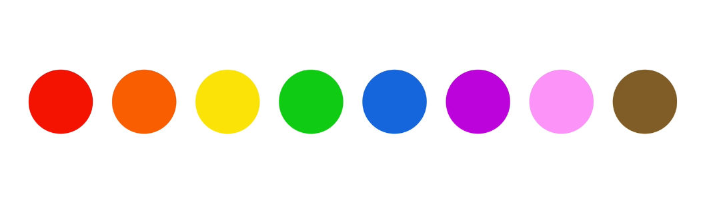

## **Using Color Like A Pro**

---

1. Use only one base color.Best resource to choose base color (https://flatuicolors.com/) after choosing base color craete lighter and darker version of that base color.

2. [Use a tool if you want to use more colors.](https://color.adobe.com/create/color-wheel).

3. Use color to draw attention.

4. Never use black in your design.

5. choose colors wisely.

## The Meaning Of Colors In Web Design =>

Picking a color for a website means more then picking your favorite color and turning it into a design. It means picking the right color in order to get the desired response from your audience. Color really makes a difference. This happens because there are psychological effects behind each color.

- Red is a great color to use when power, passion, strength and excitement want to be transmitted. Brighter tones are more energetic and darker shades are more powerful and elegant.

- Orange draws attention without being as overpowering as red. It means cheerfulness and creativity. Orange can be associated with friendliness, confidence, and courage.

- Yellow is energetic and gives the feeling of happiness and liveliness. Also, it associates with curiosity, intelligence, brightness, etc.

- Green is the color of harmony, nature, life and health. Also, it is often associated with money. In design, green can have a balancing and harmonizing effect.

- Blue means patience, peace, trustworthiness, and stability. It is one of the most beloved colors, especially by men. It is associated with professionalism, trust and honor. That's actually why the biggest social networks use blue.

- Purple is traditionally associated with power, nobility and wealth. In your design, purple can give a sense of wisdom, royalty, nobility, luxury, and mystery.

- Pink expresses romance, passivity, care, peace, affection, etc.

- Brown is the color of relaxation and confidence. Brown means earthiness, nature, durability, comfort, and reliability.

---
