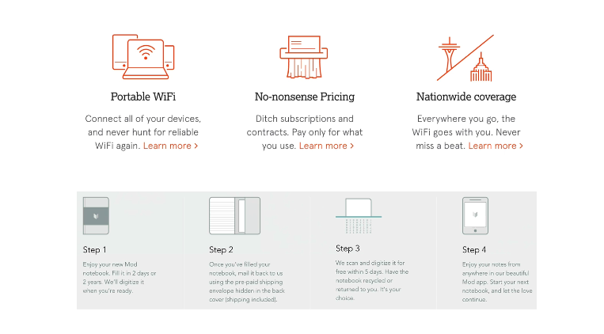
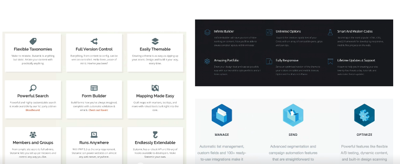
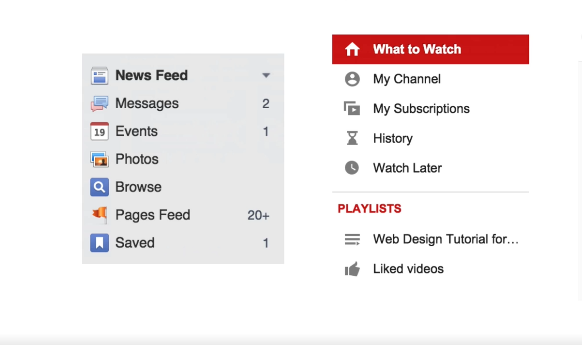
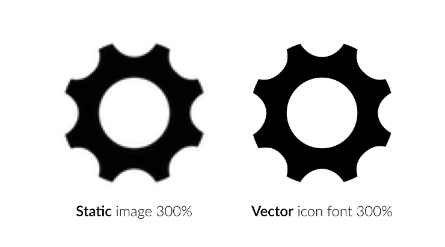

## Working with Icons.

Icons can be a very important part of the Web designer's work.

Icon improve the aesthetic of our websites and can provide a better user experience, if well-used,

it is actually pretty incredible how much power I can have in determining the look and feel of an entire website. But icons can also cause user confusion when poorly used.

This is why there are some very simple basic guidelines you should follow.

1. Use icons to list features/Steps.
   you can use icons to show features of your website or a product that you're selling or steps that a user should follow to achieve some goal.

   This is a powerful, modern and beautiful way of showing what your side has to offer.

   Icon actually help the user to quickly browse through a page and get an idea what the website is all about. So I strongly recommend you to use icons in your design in these situations.

   

   

2. Use icons for actions and links.
   You can use icons for actions and links, popular Web sites like Facebook or YouTube do exactly this, and I'm sure you see this all the time, indicates you use icons for doing this.

   

   There are two rules to follow.

   - First, your icons should be instantaneously recognizable and remove open interpretation.

   - Label your icons if you have enough space to do so, because otherwise you may confuse your users.

3. Icons should not take a cxenter stage.
   they should not take center stage in your design. Instead, they should play a supporting role.

4. Use only icon fonts whenever possible.
   there are two types of eye conformance icons and form of images, and Icon font, Icon font are smooth vector images instead of common raster images to display icons on your website.

   

   I strongly recommend you to use icon fonts for web design whenever possible.

   And that's because Vector's scale endlessly up or down for any resolution.

   This is especially important for today's high resolution displays font in most smartphones and some computers, such as the retina Max.
