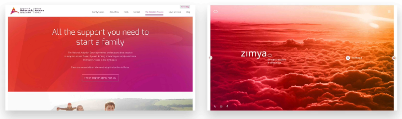
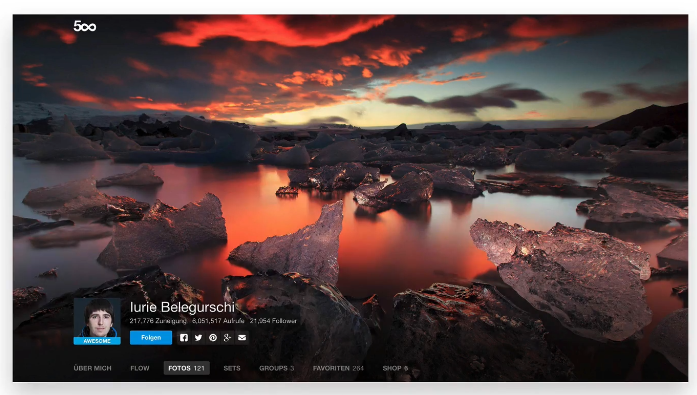

## Working with Images

These days, big and beautiful images are everywhere in Web design.

In fact, using large background images can make your website look more attractive and create more user engagement.

It has actually been found that image heavy websites convert better. So that's great news.

So you totally have to know how to work with images.

## How to effectively put text over images.

1. Put text directly on the image.
   The problem is that this only works if the image is quite dark and your text is white.

   this only work if image is quite dark otherwise you face contrast issue.
   The easiest solution to this problem is to overlay the image with a color the most usual and ofcourse simple to use color is black, which simply turns the image darker as these two beautiful websites.

   

   But we can also use other colors as well and create some beautiful effects with them. And we can do even more. We can use color gradients to achieve stunning effects like this below image.

   
   it is important that you keep in mind what we've learned about colors, which means that you should not just use some random colors

   So please use image overlay, which colors other than black or white very carefully.

2. Put your text in box.
   Putting the text in a box is another easy way to make your text stand out and easy to read like the designer of this website did, the box should be opaque so that you can still see the image beneath it.

   

   You can also make the box black or go with some other color that you selected for your design.

3. Blur the image.
   You can either blur the whole image like these two websites do, or you can use an out of focus area of a photo as a blur like the first of these two websites.

   
   

   In this case, we need to make sure that the text stays on the blurred image part on all screen resolutions.

   This is particularly important for responsive web design.

4. The Floor Fade.
   The floor fight is a technique where an image subtly fades towards black at the bottom with white text written over it.

   

## Use CSS To Work With Images -->

To achieve the text-on-image effects I showed you before, you can use CSS for your websites. Here is example CSS code for some of the effects. Please change it according to your needs.

Overlay the image

```
.darken {

background-image: linear-gradient(rgba(0, 0, 0, 0.5), rgba(0, 0, 0, 0.5)), url(YOUR IMAGE HERE);

}
```

Example:- [Overlay the image](http://jsfiddle.net/drpak8vy/1/)

Put text in a box

```
.text-box {

background-color: rgba(0, 0, 0, 0.5);

color: #fff;

display: inline;

padding: 10px;

}
```

Example:- [Put text in a box](http://jsfiddle.net/qg83m36p/)

Floor fade

```
.floor-fade {

background: linear-gradient(to bottom, rgba(0, 0, 0, 0), rgba(0, 0, 0, 0.6) ), url(YOUR IMAGE HERE);

}
```

Example:- [Floor fade](http://jsfiddle.net/gRzPF/409/)
